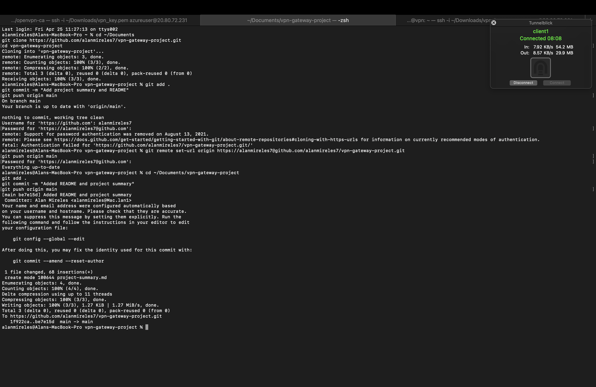

# VPN Gateway Project

## Explanation of the Project

This project involves setting up an OpenVPN Gateway on an Ubuntu server hosted in Microsoft Azure. The goal is to simulate a real-world secure remote access scenario by establishing a secure tunnel between a remote client and a private internal network. This solution is valuable for enhancing data privacy, avoiding eavesdropping, and ensuring safe remote access to resources.

## Breakdown of the Implementation

### Network Topology
We deployed one Azure-hosted Ubuntu VM as the OpenVPN server and used a macOS system as the client. The server acts as the central VPN gateway, and the client connects securely through Tunnelblick.

### Configuration Details
OpenVPN was installed and configured on the server. Keys and certificates were generated using Easy-RSA. TLS-auth with `ta.key` and a defined `key-direction` were configured. The client used a `.ovpn` file embedding all necessary security parameters for connection.

### Communication Flow
Once the client initiates the connection, the VPN tunnel is established using the embedded certificates and shared keys. Traffic from the client is securely tunneled into the internal network (10.8.0.0/24).

### Tools and Technologies
- **Microsoft Azure** for hosting the VPN server
- **Ubuntu 20.04** as the server OS
- **OpenVPN** for VPN configuration
- **Easy-RSA** for certificate management
- **Tunnelblick** for the macOS client
- **GitHub** for documentation

## Demonstration

Below are screenshots confirming successful configuration and connection:

### ✅ Server Configuration & Status

### ✅ Tunnelblick Successful Connection

### ✅ Client Config Content

---

For more technical details, refer to `project-summary.md`.
